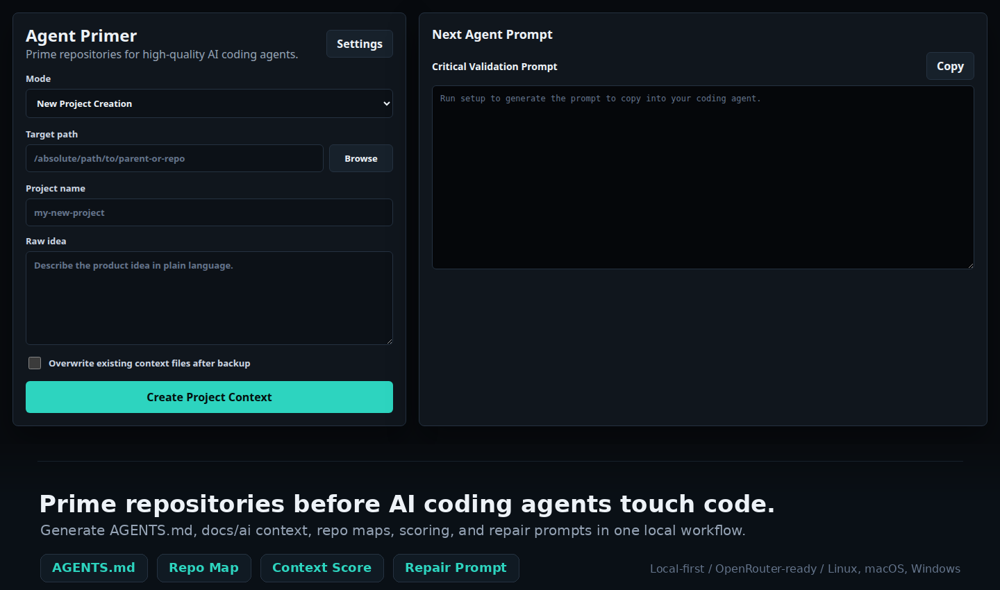

# Agent Primer

**Prime any repository for AI coding agents before they touch code.**

[](https://www.python.org/)
[](https://fastapi.tiangolo.com/)
[](LICENSE)
[](https://github.com/openai/agents.md)

Agent Primer is a local-first desktop-style GUI that creates, verifies, and repairs repository context for AI coding agents such as Codex, Claude Code, Cursor, Windsurf, Gemini CLI, and OpenCode.

It is not a coding agent. It prepares the repo so your coding agent starts with the right product context, architecture notes, verification commands, constraints, risks, and repo map.



## Why This Exists

AI coding agents fail less when the repository gives them concise, verified operating context. `AGENTS.md` has become the common project-level instruction format for coding agents, but large repos also need structured context files that stay compact, inspectable, and repairable.

Agent Primer turns that setup into a repeatable workflow:

- create a clean `AGENTS.md`;
- create `docs/ai/*` context files;
- detect scripts, manifests, CI, env examples, source directories, tests, and symbolic areas;
- score context readiness;
- produce a repair prompt for your coding agent;
- keep API keys and generated prompts out of target repos.

## What It Creates

```text
AGENTS.md
docs/ai/product.md
docs/ai/context.md
docs/ai/architecture.md
docs/ai/verification.md
docs/ai/constraints.md
docs/ai/risks.md
docs/ai/repo-map.md
```

## Agent Instruction Compatibility

`AGENTS.md` is the portable baseline. Tools that support it directly, such as Codex, can load the repository instructions without extra setup.

Some agents still prefer their own instruction files:

- **Codex**: reads `AGENTS.md` directly, including nested overrides.
- **Claude Code**: commonly uses `CLAUDE.md`.
- **Gemini-style tools**: commonly use `GEMINI.md`.
- **Cursor, Windsurf, Copilot, and others**: may combine project rules, IDE settings, and Markdown context files.

Agent Primer keeps `AGENTS.md` as the source of truth and generates prompts that explicitly tell any coding agent to read `AGENTS.md` plus `docs/ai/*.md`. That keeps the context useful even when a tool does not auto-load `AGENTS.md`.

## Modes

### 1. New Project Creation

Use this when you have an idea but no repo yet.

Agent Primer creates the project folder, writes a provisional context pack, and gives you a critical validation prompt. The prompt asks your coding agent to challenge the plan, research current alternatives, and improve the approach before implementation.

### 2. Existing Project Context Setup

Use this for a real codebase.

Agent Primer creates templates with `AGENT_FILL` markers. Your coding agent then fills those sections from code, tests, manifests, CI, README files, environment examples, and runtime config. This mode does not call an LLM API and does not pretend the docs are already final.

### 3. Context Verification & Repair

Use this after context exists.

Agent Primer scores the context pack, reports missing or generic sections, detects weak repo maps, and generates a repair prompt that tells your coding agent exactly what to fix.

## Key Features

- **Local-first GUI**: runs on `127.0.0.1`; no hosted backend.
- **Native folder picker**: choose target repos through Linux, macOS, or Windows file pickers.
- **Cross-platform runners**: launch from `run/` on Linux, macOS, or Windows.
- **AGENTS.md support**: generates the standard root instruction file for coding agents.
- **Structured AI docs**: creates product, context, architecture, verification, constraints, risks, and repo-map files.
- **Repo-map generation**: detects source areas, tests, CI, auth boundaries, API routes, database layers, and other symbolic areas.
- **Readiness scoring**: checks completeness, specificity, verification quality, repo-map usefulness, and stale/generic markers.
- **Repair prompts**: produces a focused prompt for fixing context without touching app code.
- **OpenRouter support**: optional model selection for new-project planning.
- **No target-code changes**: context setup never edits product code.

## Run Locally

Linux:

```bash
./run/linux.sh
```

macOS:

```bash
./run/macos.sh
```

Windows PowerShell:

```powershell
.\run\windows.ps1
```

Windows double-click or Command Prompt:

```cmd
run\windows.cmd
```

Each runner creates `.venv` when needed, installs Agent Primer in editable mode, and starts the local GUI.

Open:

```text
http://127.0.0.1:8765
```

## Manual Install

```bash
cd agent-primer
python -m venv .venv
source .venv/bin/activate
pip install -e ".[dev]"
agent-primer
```

Compatibility:

| OS | Runner | Native folder picker |
| --- | --- | --- |
| Linux | `run/linux.sh` | `zenity`, `kdialog`, or `yad` |
| macOS | `run/macos.sh` | `osascript` |
| Windows | `run/windows.ps1` or `run/windows.cmd` | PowerShell FolderBrowserDialog |

CI verifies the test suite on Linux, macOS, and Windows for Python 3.11 and 3.12.

## OpenRouter Settings

Open **Settings**, paste your OpenRouter API key, choose the default model, and save.

You can also provide the key through the environment:

```bash
export OPENROUTER_API_KEY="sk-or-..."
```

Saved settings live at:

```text
~/.config/agent-primer/config.json
```

The config file is written with `0600` permissions. API keys are never written to target repos or generated context files.

## Model Presets

Agent Primer keeps model choices intentionally small:

- **Gemini 3.5 Flash**: default value pick for fast context analysis.
- **GPT-5.5 Extra High**: premium reasoning alternative.
- **Claude Opus 4.7 Max**: maximum-effort architecture alternative.

You can also choose **Custom OpenRouter model** and enter any supported OpenRouter model ID, such as `provider/model-name`.

## Backups

Existing context files are preserved by default. If overwrite is enabled, backups are written to:

```text
.agent-primer/backups/YYYYMMDD-HHMMSS/
```

## Tests

```bash
pytest -q
node --check web/app.js
```

## Security

- All writes are scoped to the selected target path.
- Target project dependencies are never installed.
- API keys are stored only in the local config file.
- Existing context files are not overwritten unless you enable overwrite.
- Generated LLM JSON is validated before use.
- User input is treated as untrusted path/config input.

## Roadmap

- Packageable desktop builds.
- Better repo-map scoring from AST-aware scans.
- Private benchmark runner for context quality.
- Optional model comparison pass for new-project planning.
- Context drift detection between docs and code.

## Related Standards And Ideas

- [`AGENTS.md`](https://github.com/openai/agents.md): the open instruction format for coding agents.
- [GitHub `coding-agents` topic](https://github.com/topics/coding-agents): ecosystem discovery for coding-agent tools.

## License

MIT. See [LICENSE](LICENSE).
